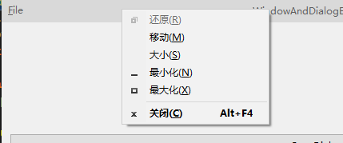
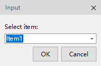
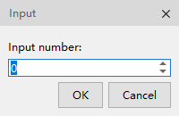
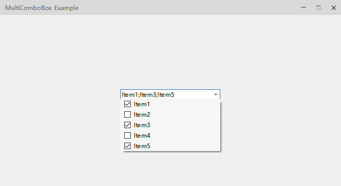
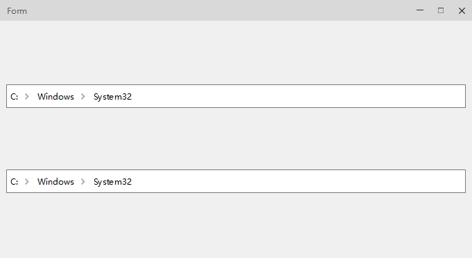
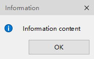
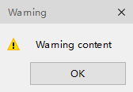
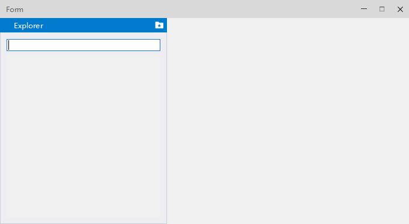

# QCustomUi

[TOC]

## 一、简介

QCustomUi是一个自定义UI库，主要提供无边框窗口和一些自定义控件，方便Qt开发。
当前库于Qt5.15.2和Qt6下编译通过。

编译完成后，点击安装，会自动安装设计器插件到QtDesigner和QtCreator下。
>注意：如果没有将Qt的运行库设置到PATH环境变量中，QtCreator可能缺乏某些QCustomUi依赖的Qt库而无法加载设计器插件。

## 二、编译

现在QCustomUi默认仅编译QCustomUi本身，若需要编译Examples，则在CMake中将**BUILD_EXAMPLES**选项激活，若要编译Tests，则在CMake中将**BUILD_TESTS**选项激活，若要编译Qt设计器插件，则在CMake中将**BUILD_DESIGNER**选项激活。

## 三、控件介绍

### 1. 基本窗口

#### QCtmWindow

QCtmWindow 是一个顶层窗口类，默认带有自定义的标题栏，支持在标题栏上添加菜单，显示图标，添加控件，系统右键菜单等，另外支持windows窗口的屏幕边缘拖拽效果：

#### QCtmDialog

与QCtmWindow相似，为Dialog类型窗口的封装，支持windows窗口特效：

### 2. 按钮

#### QCtmSwitchButton

状态切换按钮

### 3. 进度条

#### QCtmStageProgressBar

节点进度条

#### QCtmCircleProgressBar

圆形进度条

### 4. 输入框

#### QCtmInputDialog

输入窗口

与QInputDialog功能相同，为风格统一实现

#### QCtmDigitKeyboard

输入数字键盘窗口

方便为带单位输入和触摸屏输入

#### QCtmIPAddressEdit

IP地址输入框

与windows的IP地址输入框类似

#### QCtmMultiComboBox

可多选的combobox

#### QCtmPathBrowser

路径浏览器

### 5.消息窗口

#### QCtmMessageBox

行为与QMessageBox一致

#### QCtmMessageTipButton

#### QCtmMessageTipView

消息提示按钮和列表

### 6.容器部件

#### QCtmToolBox

工具窗口

#### QCtmDrawerWidget

抽屉窗口

### 7.加载窗口

#### QCtmLoadingDialog

### 8. 视图

#### QCtmClassifyTreeView

分类视图

#### QCtmAbstractMultiPageItemModel

#### QCtmAbstractMultiPageTableModel

#### QCtmMultiPageStringListModel

#### QCtmMultiPageButtonBox

分页视图系列

