# QCustomUi

[TOC]

## 控件介绍

### 1. 基本窗口

#### QCtmWindow

QCtmWindow 是一个顶层窗口类，默认带有自定义的标题栏，支持在标题栏上添加菜单，显示图标，添加控件，系统右键菜单等，另外支持windows窗口的屏幕边缘拖拽效果：

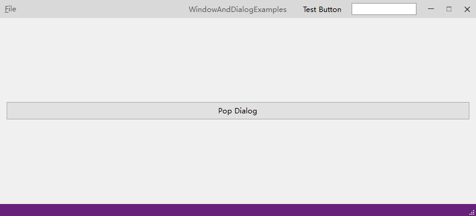

#### QCtmDialog

与QCtmWindow相似，为Dialog类型窗口的封装，支持windows窗口特效：

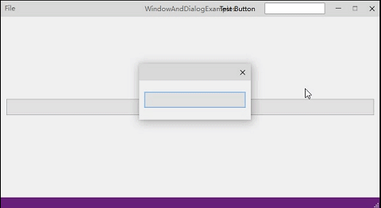

### 2. 按钮

#### QCtmSwitchButton

状态切换按钮

#### QCtmSelectionButtonBox

选择按钮组合组件，支持多选，单选，单选（可取消选中），水平排布，垂直排布，可以替代radiobox，checkbox

### 3. 进度条

#### QCtmStageProgressBar

节点进度条

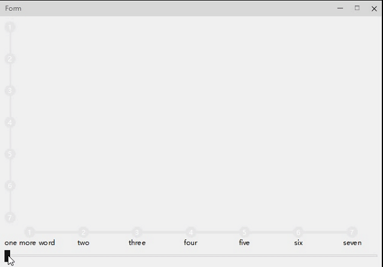

#### QCtmCircleProgressBar

圆形进度条

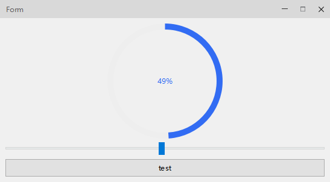

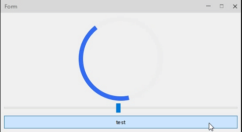

### 4. 输入框

#### QCtmInputDialog

输入窗口

与QInputDialog功能相同，为风格统一实现

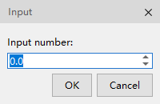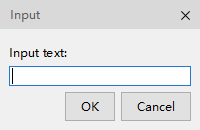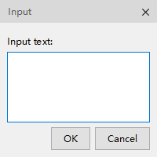

#### QCtmDigitKeyboard

输入数字键盘窗口

方便为带单位输入和触摸屏输入

#### QCtmIPAddressEdit

IP地址输入框

与windows的IP地址输入框类似

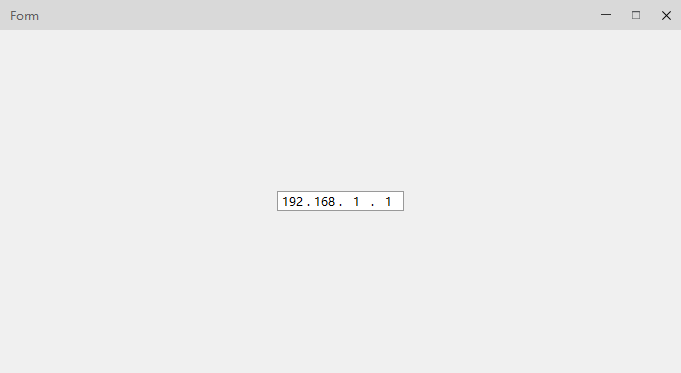

#### QCtmMultiComboBox

可多选的combobox

#### QCtmPathBrowser

路径浏览器

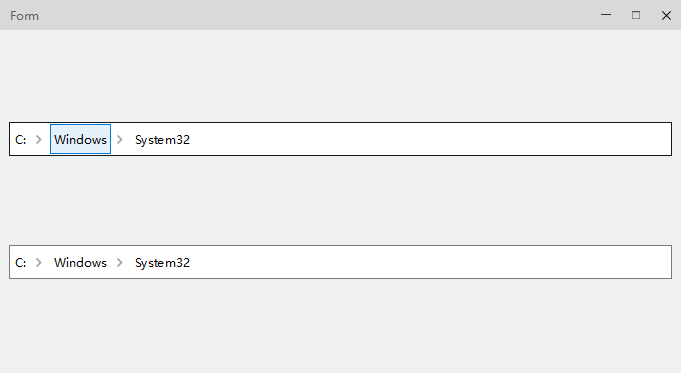

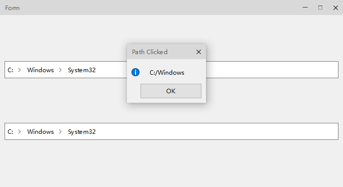

#### QCtmLongLongSpinBox

#### QCtmULongLongSpinBox

提供64位长整型的数字输入框

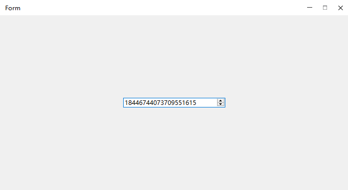

#### QCtmHexLineEdit

提供16进制单行输入功能

#### QCtmSerialPortComboBox

点击时自动刷新窗口列表的选择框

### 5.消息窗口

#### QCtmMessageBox

行为与QMessageBox一致，并提供倒计时自动关闭的功能

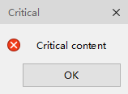

#### QCtmMessageTipButton

#### QCtmMessageTipView

消息提示按钮和列表

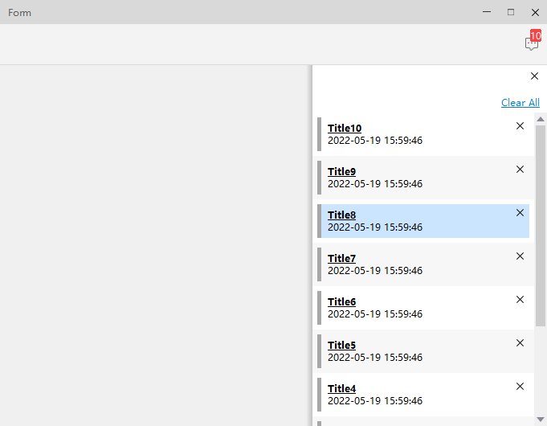

### 6.容器部件

#### QCtmToolBox

工具窗口

#### QCtmDrawerWidget

抽屉窗口

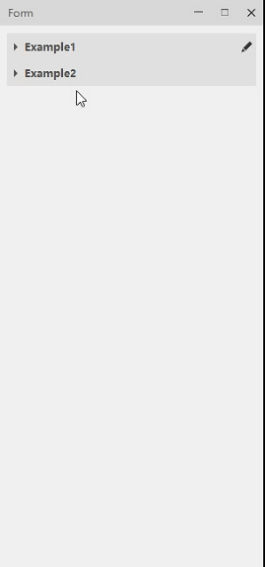

### 7.加载窗口

#### QCtmLoadingDialog

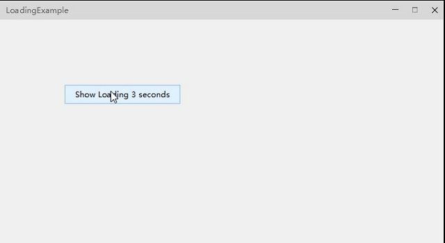

### 8. 视图

#### QCtmClassifyTreeView

分类视图

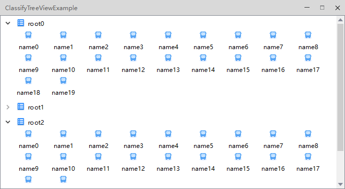

#### QCtmAbstractMultiPageItemModel

#### QCtmAbstractMultiPageTableModel

#### QCtmMultiPageStringListModel

#### QCtmMultiPageButtonBox

分页视图系列

#### QCtmRecentView

#### QCtmRecentModel

#### QCtmRecentViewDelegate

最近使用的文件/项目视图

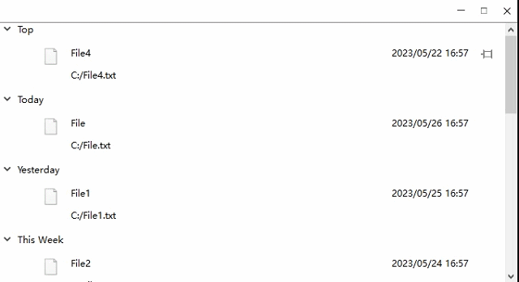

#### QCtmTableViewButtonsDelegate

QCtmTableView的按钮委托

### 9. 滑动条

#### QCtmRangeSlider

范围滑动条

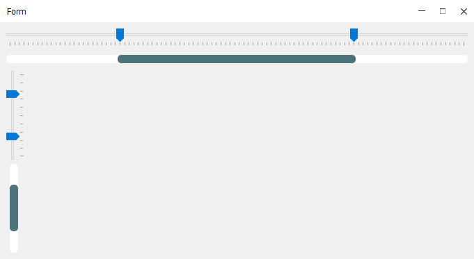
